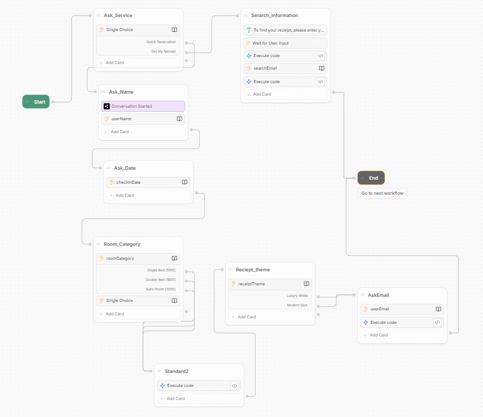
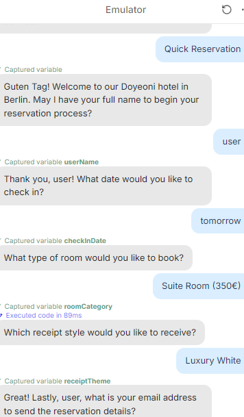

# 🤖 AI-Driven Merchant Service Automation
> **Architecting an End-to-End Pipeline for Hospitality Operations using LLM & Workflow Orchestration**

## 📌 Project Overview
Leveraging my professional background in the hospitality industry, I identified a critical operational bottleneck: **manual receipt reissuance.** This process is often prone to human error and leads to customer dissatisfaction. 

This project solves this by architecting an automated AI pipeline that handles real-time reservations and instant document generation with **100% data integrity.**

## 🛠 Tech Stack
* **Conversational AI:** Botpress (LLM-based NLU for Intent Recognition)
* **Workflow Orchestration:** Make.com (RESTful Webhooks & JSON Routing)
* **Database:** Google Sheets (Structured Data Persistence)
* **Output Engine:** Google Workspace API (Dynamic PDF Generation & Automated SMTP)

## 🚀 Key Engineering Highlights

### 1. Intent Classification & Multi-Workflow Branching
I designed a **Conversational UI** that distinguishes between user intents (e.g., "New Reservation" vs. "Receipt Reissuance"). Based on the identified intent, the system triggers divergent logic paths in the integration layer, ensuring efficient resource allocation.

### 2. Resolving Data Integrity Challenges (Troubleshooting)
* **Problem:** Identified a **Schema Mismatch** where transactional metadata (Price/Category) was missing in production outputs.
* **Solution:** * Re-engineered the database schema for comprehensive metadata support.
  * Implemented a **Validation Layer** to verify data completeness before the document generation stage.
* **Result:** Achieved **100% automated data accuracy**, eliminating "Empty Field" errors.

## 📊 System Architecture & Interface
Below are the core components of the system design:

### **System Workflow**
 
*Figure 1. End-to-End System Architecture*

### **Conversational UI (Emulator)**

*Figure 5. Botpress Emulator showing the intent selection interface*

## 📄 Full Documentation
For a deep dive into the engineering process, Root Cause Analysis(RCA), and detailed troubleshooting steps, please refer to my technical report:

👉 [**Download Full Technical Report (PDF)**](./Technical_Report_Doyeon_Yeon.pdf)

---
© 2025 Doyeon Yeon. All rights reserved.
